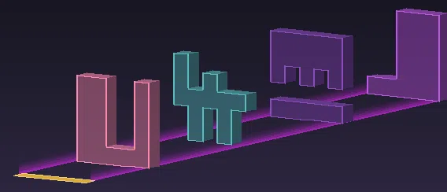

<div align="center">
  <h1>
    <a href="https://sandstone.dev"></a>
    +
    <a href="https://smithed.net"></a>
  </h1>

  <h1>Summit 2026 Booth</h1>

  <p>The <a href="https://sandstone.dev">Sandstone</a> booth for <a href="https://smithed.net/summit">Smithed Summit 2026</a>,<br>
  written entirely in TypeScript.</p>

  <a href="https://smithed.net/summit"></a>
</div>

## The booth

Three things share the booth. The main attraction is an in-game presentation of
Sandstone itself: slides rendered inside Minecraft that walk through what the library
does and let you browse this repository's code, and the patterns it uses, without
leaving the game.

Next to it runs a rhythm minigame: pick a song, press start, and dodge the glass walls
sliding at you in sync with the music, with lives, combos, parkour breaks and per-song
leaderboards (deathless clears get their own board). There is also a magic showcase to
try.

There is no handwritten `.mcfunction` in this repository. The datapack and resource pack
are compiled from the TypeScript in `src/` by Sandstone: songs are parsed from MIDI/NBS
files at build time, note playback and wall charts are generated from them, and the wall
models, their border textures and the shader-driven skyboxes are all produced by the
build as well.

## The rhythm game



Each song is a plain MIDI or NBS file. The build generates the
wall chart from its notes and compiles playback down to
scheduled functions, with repeated musical moments deduplicated
into shared ones.

The walls are build products too. Each obstacle is a small grid
in TypeScript that becomes an item model with generated border
textures, and the whole arena derives from a single configured
coordinate: the gold line.

<br clear="both">

## The magic showcase

<placeholder>

## Building

```bash
bun install
bun dev:build   # build once
bun dev:watch   # rebuild on change
```

To have builds land directly in your Minecraft instance, create a `.env`:

```bash
CLIENT_PATH="/path/to/your/.minecraft/"
WORLD="YourTestWorld"
```

The pack is then linked into that world's datapacks and your resource pack folder, so a
`/reload` in game picks up every build. `bun run dev:deploy` pushes to the internal build
server. A compiled copy of the packs lives on the `generated` branch.

## Layout

```
src/sections/rhythm/   the rhythm game (game logic, config, generated models)
src/sections/magic/    magic showcase
maps/                  arena structures, one per theme
songs/public/          song sources (MIDI/NBS) and songs.json
resources/             hand-made resource pack assets and datapack dependencies
```

## Adding a song

Drop a `.mid` or `.nbs` file into `songs/public/` and add an entry to `songs.json`.
Songs play as noteblock covers by default; put an `.mp3` with a matching name next to
the source file and the build renders streamed audio segments instead. Wall charts and
parkour events are generated from the notes, scaled by the song's difficulty setting.

## Credits

Rhythm game by [Origaming](https://github.com/OrigamingWasTaken). Booth infrastructure,
deployment and the Sandstone presentation by [MulverineX](https://github.com/MulverineX).
Magic showcase by [Lilspartan](https://github.com/Lilspartan). Built with [Sandstone](https://github.com/sandstone-mc/sandstone).

MIT licensed.
